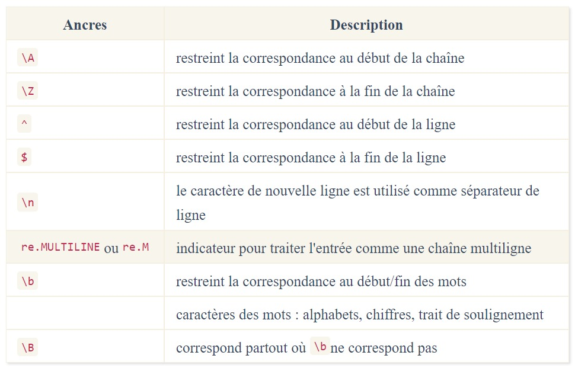
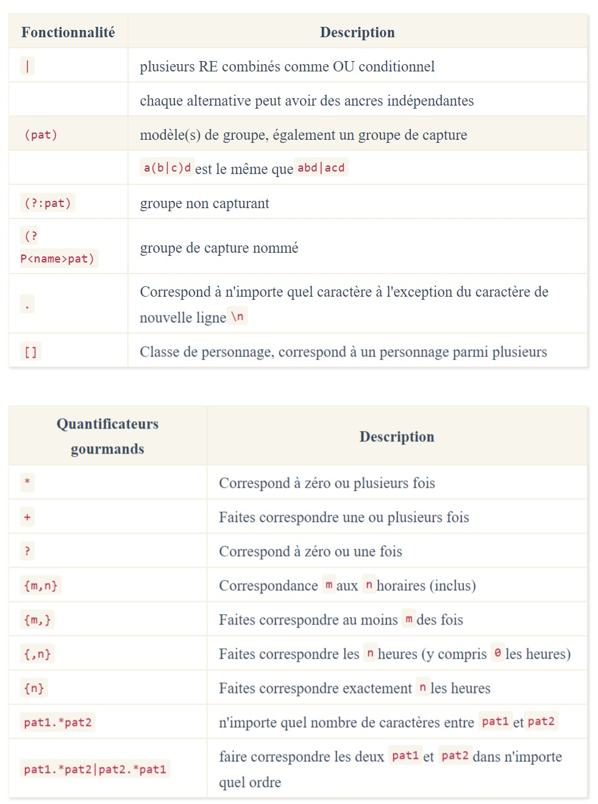
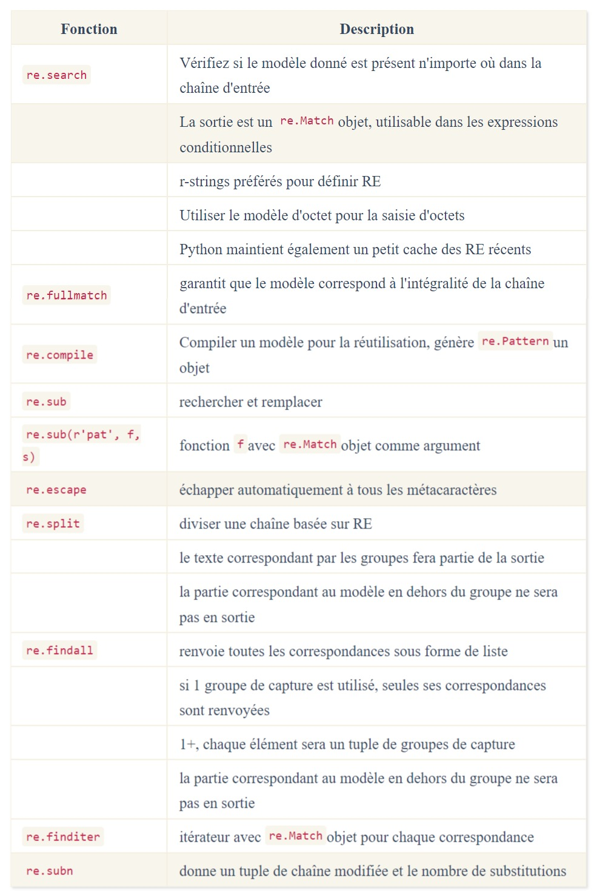

## **Aide-mémoire et exemples d'expressions régulières Python**

---

| CONTENU                                                                                  |
|------------------------------------------------------------------------------------------|
| **Éléments qui définissent une expression régulière concernant les fonctions du module** |
| **Exemples d'expressions régulières**                                                    |
| **Comprendre Python re(gex) ?**                                                          |

<title>Visualisation ci-dessus créée à l'aide de debuggex pour le modèle r'\bpar(en|ro)?t\b'</title>

+ **`Une expression régulière (ou re)`** spécifie un ensemble de chaînes qui lui correspondent ; les fonctions de ce module vous permettent de vérifier si une chaîne particulière correspond à une expression régulière donnée.

### **Éléments qui définissent une expression régulière 🔗**

+ `^, $ et \` sont des métacaractères dans le tableau ci-dessus, car ces caractères ont une signification particulière. Préfixez un caractère `\` pour supprimer la signification particulière et faire correspondre ces caractères littéralement. 
+ Par exemple, `\^` fera correspondre un caractère `^` au lieu d'agir comme une ancre.

+ Gourmand signifie ici que les quantificateurs ci-dessus correspondront autant que possible, ce qui honorera également le `RE` global. 
+ Ajouter `a ?` aux quantificateurs gloutons les rend non gloutons , c'est-à-dire qu'ils correspondent le moins possible. 
+ Ajouter un `+` à des quantificateurs gourmands les rend possessifs , ce qui empêche tout retour en arrière. Vous pouvez également utiliser `(?>pat)` le regroupement atomique pour vous protéger contre le retour en arrière. Les quantificateurs peuvent être appliqués aux caractères littéraux, aux groupes, aux références arrière et aux classes de caractères.

+ Info `\0 et \100` au-delà sont considérés comme des valeurs octales et ne peuvent donc pas être utilisés comme références arrière.

### **concernant les fonctions du module 🔗**

+ Les définitions des fonctions sont données ci-dessous :

        re.search(pattern, string, flags=0)
        re.fullmatch(pattern, string, flags=0)
        re.compile(pattern, flags=0)
        re.sub(pattern, repl, string, count=0, flags=0)
        re.escape(pattern)
        re.split(pattern, string, maxsplit=0, flags=0)
        re.findall(pattern, string, flags=0)
        re.finditer(pattern, string, flags=0)
        re.subn(pattern, repl, string, count=0, flags=0)
